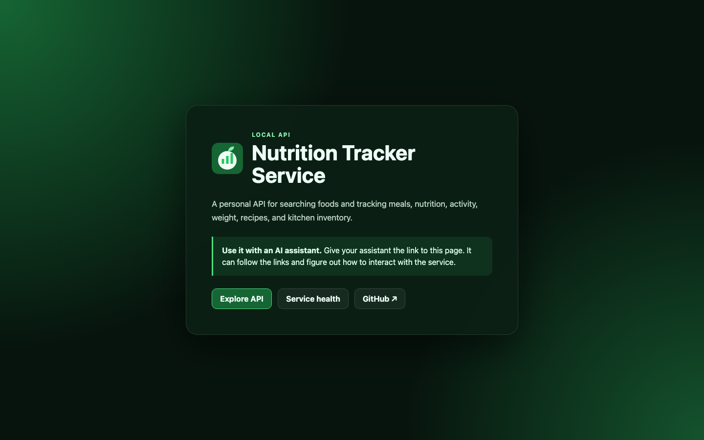

# Nutrition Tracker

A personal nutrition tracking API built with FastAPI and SQLite.

OpenAPI schema is served at `/openapi.json` on your own deployment.



## What it does

REST API for logging food, weight, activity, events, and journal entries. Designed to be called by AI agents or mobile clients.

Reusable user definitions expose a first-class `is_private` boolean. This
applies to event types, food catalog items, recipes, and favorite meals.
Logged events and diary responses also expose the current privacy of their
referenced definition, while immutable food snapshots retain the value that
was present when the entry was logged.

Key endpoints:
- `GET /foods/search?q=` — full-text search across USDA + OpenFoodFacts + custom foods
- `GET /foods/sources` — data sources behind the catalog, with licence, citation and quality tier
- `GET /foods/barcode/{barcode}` — barcode lookup; caches a matching live Open Food Facts product on a local miss
- `POST /diary/{date}/entries` — log what you ate
- `GET /stats/daily/{date}` — daily nutrition totals with meal breakdown
- `POST /weight` — log body weight
- `POST /events/types` — define your own event categories, then `POST /events` to log them
- `POST /recipes` — build recipes with auto-computed nutrition math
- `POST /imports/activity/steps` — import step count data
- `POST /kitchen/inventory` — remember what you have, use soon, maybe have, are out of, or treat as a staple
- `POST /kitchen/matches` — rank favorite meals from current kitchen inventory
- `POST /kitchen/shopping-list/generate` — generate grocery items from selected favorite meals

All endpoints (except `/health`) require `Authorization: Bearer <token>`.

## Events

A general log of things that happened, deliberately not fitness-specific and
with nothing pre-seeded. You define the categories you care about, and each
one carries whatever unit you measure it in:

```bash
curl -X POST http://127.0.0.1:8000/events/types \
  -H "Authorization: Bearer $NT_BEARER_TOKEN" \
  -H "Content-Type: application/json" \
  -d '{"name":"Red light therapy","unit":"minutes"}'

curl -X POST http://127.0.0.1:8000/events \
  -H "Authorization: Bearer $NT_BEARER_TOKEN" \
  -H "Content-Type: application/json" \
  -d '{"event_type_id":1,"date":"2026-08-02","at":"19:30","value":5,"notes":"panel at 18 inches"}'
```

`value` is optional — some events are just "this happened" — and `0` is
treated as a real measurement rather than a missing one. Each event stores the
unit it was logged with, so editing a type's unit later does not silently
reinterpret readings already recorded.

`GET /events/summary?start=&end=` totals events per type. It groups by unit as
well, so a type whose unit changed part-way through reports each unit on its
own row instead of adding values that do not share a scale.

Deleting a type that still has events is refused unless you pass
`cascade=true`, so history is not discarded by accident.

## Users

Single-user mode is the default. Under the hood it uses one **Default user**
for all personal records, so existing deployments need no user configuration.

Enable multi-user mode only when separate personal data is needed:

```bash
NT_MULTI_USER_ENABLED=true
```

With multi-user mode enabled, the configured `NT_BEARER_TOKEN` is the admin
and default-user token. Use it to create a separate bearer token for each
additional user:

```bash
curl -X POST http://127.0.0.1:8000/users \
  -H "Authorization: Bearer $NT_BEARER_TOKEN" \
  -H "Content-Type: application/json" \
  -d '{"name":"Second user"}'
```

The response includes the new token once. Each user token scopes diary, recipes,
weight, journal, activity, events, kitchen, shopping lists, and custom foods to that
user. USDA and Open Food Facts catalog foods remain shared.

## Stack

- Python 3.12, FastAPI, SQLite (WAL mode)
- Deploys as a systemd service on a small host, or via Kamal 2 to a container host
- CI: Woodpecker (lint → secret-scan → test → deploy)

## Docs

- [Docs index](docs/index.html)
- [Printing Press API-to-Agent Workflow](docs/superpowers/specs/2026-05-25-printing-press-api-to-agent-workflow-design.md)
- [Companion Hermes skill draft](docs/hermes/skills/printing-press-api-to-agent-workflow/SKILL.md)

## Deployment

Two supported targets. They share `deploy/deploy.env`, so a host can move
between them without a second config file.

| | **systemd** | **Kamal** |
| --- | --- | --- |
| Runs | git checkout + virtualenv | container image |
| Needs | Python 3.12+, systemd, git | Docker, a registry, a build host |
| Suits | Raspberry Pi, small VPS, anything memory-constrained | multi-host or container-native setups |
| Install | `bin/install-systemd` | `kamal deploy` |

Deployment targets are not committed. Copy the template and fill in your host:

```bash
cp deploy/deploy.env.example deploy/deploy.env
```

`deploy/deploy.env` is gitignored, and every `bin/` script reads it, so host
names, SSH users and key paths stay out of the repository. The example ships
with placeholders — replace them with your own host before deploying.

### Small hosts (systemd)

The low-resource path: no container runtime, no registry, no build step. A
Raspberry Pi 4 runs the full 947k-food catalog comfortably this way.

```bash
bin/install-systemd             # provision the host, then start the service
```

The installer is idempotent and safe to re-run. It clones the checkout, creates
the virtualenv, generates `/etc/nutritiontracker/nutritiontracker.env` with a
fresh admin bearer token on first run only, and writes a separate loopback-only
token to `~/.config/nutritiontracker/config.json` with mode `0600`. The local
token maps to the default user but never grants user-administration access and
is rejected when the socket peer is not loopback. The installed CLI loads this
file automatically, so local agents can run ordinary nutrition commands without
reading the root-only service environment. Re-running never rotates existing
tokens.

The unit is generated from
[`deploy/systemd/nutritiontracker.service.template`](deploy/systemd/nutritiontracker.service.template),
which ships with resource guards sized for a 2–4 GB board (`MemoryMax=768M`,
`TasksMax=64`) and systemd sandboxing (`ProtectSystem=strict`,
`NoNewPrivileges`, a `@system-service` syscall filter), with the database
directory granted back through `ReadWritePaths`. Override any of it from
`deploy/deploy.env` — see the commented block in the example.

The service binds `127.0.0.1` by default, so it is not reachable off the host
until you put a tunnel or reverse proxy in front of it. To reach it directly
for testing:

```bash
ssh -L 8000:127.0.0.1:8000 <user>@<host>
```

Day-to-day operation:

```bash
bin/deploy                          # fetch, migrate and restart the service
bin/db-backup --pull /tmp/live.db   # consistent online backup of the live DB
bin/db-push data/nutrition.db       # replace the food catalog, keeping diary data
```

`bin/db-push` is the safe way to ship a rebuilt catalog: a rebuilt database
contains no diary, weight or recipe records, so the script backs up the live
database, merges the personal tables into the incoming file with
`scripts/migrate_personal_data.py`, refreshes every diary and recipe nutrient
snapshot from the incoming catalog, verifies foreign keys, and only then swaps
it in. This applies newly available nutrient detail to foods, supplements,
medications, custom items, and public-database items without copying the food
catalog into downstream viewers. Each snapshot stores a deterministic
item-content version, so later pushes skip unchanged items and refresh only
entries and recipes whose food content actually changed. The previous database
is kept alongside the new one.

After a direct correction to food rows outside a catalog push, refresh saved
snapshots explicitly:

```bash
python -m scripts.recompute_nutrient_snapshots --db data/nutrition.db
```

### Container hosts (Kamal)

`kamal deploy` reads `config/deploy.yml`, which takes its target from the same
`deploy/deploy.env` values. Ignore the systemd-only variables on these hosts.

### Continuous deployment

`config/deploy.yml` reads its target from the environment too, so the CI
pipeline needs these Woodpecker secrets alongside the existing
`deploy_ssh_key`, `NT_BEARER_TOKEN`, `CLOUDFLARE_TUNNEL_TOKEN` and
`KAMAL_REGISTRY_PASSWORD`:

| Secret | Used for |
| --- | --- |
| `NT_DEPLOY_HOST` | the `servers:` and registry host |
| `NT_DEPLOY_USER` | the `ssh: user:` |
| `NT_PUBLIC_HOST` | the `proxy: host:` |

## Local development

```bash
pip install -e ".[dev]"
pytest tests/
```

## CLI

Installing the package provides the `nutritiontracker` command. It connects to
`http://127.0.0.1:8000` by default and automatically loads
`~/.config/nutritiontracker/config.json` when present. Flags override environment
variables, which override that file. Use environment variables for another
deployment:

```bash
export NT_BASE_URL=https://nutrition.example.com
export NT_BEARER_TOKEN=your-token

nutritiontracker health
nutritiontracker foods search "chicken breast"
nutritiontracker diary add 123 150 g --meal lunch
nutritiontracker diary search "chicken breast"
nutritiontracker diary show
nutritiontracker stats daily
nutritiontracker weight add 180 --unit lb
nutritiontracker events list --start 2026-08-01
nutritiontracker kitchen inventory list --search tomato
```

The local config format is:

```json
{"base_url":"http://127.0.0.1:8000","token":"replace-with-a-local-token"}
```

Keep token-bearing config files at mode `0600`; the CLI refuses broader
permissions. Override the location with `--config` or `NT_CONFIG`.

Pass `--json` before the command for machine-readable output, such as
`nutritiontracker --json stats daily`.

The CLI has command groups for every API resource:

| Group | Coverage |
| --- | --- |
| `activity` | Daily/range queries and step imports |
| `diary` | Add, show, search, update and delete |
| `events` | Event and event-type CRUD, filtering and summaries |
| `foods` | Search, barcode lookup, sources and custom-food CRUD |
| `journal` | Create, date/range queries, update and delete |
| `kitchen` | Inventory, meal matching, favorites and shopping lists |
| `recipes` | List, get, create, update and delete |
| `stats` | Daily and date-range nutrition summaries |
| `users` | Current user, admin listing, creation and token rotation |
| `weight` | Add, list, update and delete |

Complex create and update commands accept a JSON object with `--data` or
`--data-file`, matching the corresponding OpenAPI request schema:

```bash
nutritiontracker recipes create --data-file recipe.json
nutritiontracker events update 12 --data '{"notes":"updated"}'
nutritiontracker foods create --data-file custom-food.json
```

`query` covers arbitrary read-only lookups. Parameters are repeatable and
results are always JSON:

```bash
nutritiontracker query /kitchen/inventory --param q=tomato --param status=have
nutritiontracker query /events --param start=2026-08-01 --param limit=20
nutritiontracker query /recipes --param limit=10
```

`request` exposes authenticated GET, POST, PATCH and DELETE for any current or
future endpoint:

```bash
nutritiontracker request PATCH /recipes/7 --data '{"name":"Dinner"}'
nutritiontracker request DELETE /diary/entries/42
```

## Data import

The app ships with no food data. Seed it from USDA and OpenFoodFacts.

### USDA FoodData Central

Download **Survey (FNDDS)**, **SR Legacy** and/or **Foundation Foods** JSON from
https://fdc.nal.usda.gov/download-datasets, copy to garageband, then:

```bash
bin/import-usda $NT_DATA_DIR/FoodData_Central_survey_food_json_2021-2023.json
bin/import-usda $NT_DATA_DIR/FoodData_Central_sr_legacy_food_json_2021-10-28.json
bin/import-usda $NT_DATA_DIR/foundationDownload.json
```

The importer detects the dataset from the export and tags each food with its
specific source (`usda_fndds`, `usda_foundation`, `usda_sr_legacy`,
`usda_branded`); pass `--source=<code>` to override.

**Prefer FNDDS** for generic foods: USDA fills its gaps with documented
imputation, so entries carry a complete nutrient profile instead of the zeros
SR Legacy leaves behind for unassayed nutrients. It also ships household
portions ("1 cup"), which are imported as serving sizes.

For Foundation Foods, also extract the matching CSV archive and pass its
directory as a fallback. Records omitted or invalid in the JSON export are
reconstructed from `food.csv`, `foundation_food.csv`, and `food_nutrient.csv`:

```bash
bin/import-usda $NT_DATA_DIR/foundationDownload.json \
  --csv-dir=$NT_DATA_DIR/foundation-food-csv
```

### OpenFoodFacts (US products)

Download the full compressed JSONL (~12 GB) once:

```bash
ssh "$NT_DEPLOY_USER@$NT_DEPLOY_HOST" \
  "wget -q -O $NT_DATA_DIR/openfoodfacts-products.jsonl.gz \
   'https://openfoodfacts-ds.s3.eu-west-3.amazonaws.com/openfoodfacts-products.jsonl.gz'"
```

Then import US products only (streams through the gzip — no decompression to disk needed):

```bash
bin/import-off $NT_DATA_DIR/openfoodfacts-products.jsonl.gz \
  --country=en:united-states
```

Both scripts auto-detect the current running container image. Re-running an import is safe — records are upserted by `(source, source_code)`.

## Data sources

Every food records which dataset it came from. `GET /foods/sources` returns the
registry — publisher, licence, required citation, dataset version, food count,
and a quality `tier` used to rank duplicates during search (lower is better):

| Tier | Sources | What it means |
| --- | --- | --- |
| 0 | `custom`, `recipe`, `cronometer_custom` | Your own deliberate entries — always win |
| 1 | `usda_fndds`, `nccdb` | Gap-filled: missing values imputed by documented procedures, so profiles are essentially complete |
| 2 | `usda_foundation`, `cofid`, `cnf`, `frida`, `afcd`, `nuttab` | Lab-analysed, authoritative but sparse |
| 3 | `usda_sr_legacy`, `food_data_central` | Compiled reference data, no longer maintained |
| 4 | `usda_branded`, `open_food_facts`, `crdb`, `nutritionix`, `cronometer` | Nutrition-label data — only what the manufacturer prints |

`/foods/search?source=` accepts any code above, `all`, `usda` for every USDA
dataset, or `cronometer` for everything that arrived via a personal Cronometer
export. `food_data_central` is kept as an alias matching all USDA datasets so
pre-split clients keep working.

Tier also drives search ordering, not just duplicate resolution. Results are
ranked by text relevance with a per-tier penalty, because relevance alone put
the wrong foods on top: SQLite's bm25 ties heavily (a search for "acai berry"
returned four foods with identical scores, broken arbitrarily by insertion
order) and it rewards short names, which branded label data has far more of —
"butter" used to return Butterfinger, and "spinach" returned an Open Food Facts
row of placeholder zeros ahead of any measured value. Reference sources also get
their own retrieval pass, since label data outnumbers them roughly fifty to one
and could otherwise fill the entire candidate window before a reference food was
even considered. A branded query still returns its exact match first.

Registering a new source (CNF, Frida, ...) means adding an entry to
`app/sources.py` and a normalizer in `app/providers/` — `foods.source` is a
foreign key onto the registry, so no schema migration is needed.

Attribution note: Open Food Facts data is licensed under the
[ODbL](https://opendatacommons.org/licenses/odbl/1-0/) and requires attribution;
the citation text is in `GET /foods/sources`.

### CoFID (UK)

McCance and Widdowson's Composition of Foods Integrated Dataset — 2,887 UK foods
from Public Health England, under the Open Government Licence v3.0. Download
[the 2021 workbook](https://www.gov.uk/government/publications/composition-of-foods-integrated-dataset-cofid)
and import it:

```bash
pip install -e ".[data-import]"    # needs openpyxl
python -m scripts.import_cofid ~/Downloads/cofid_2021.xlsx
```

CoFID distinguishes "not measured" (`N`) from "trace" (`Tr`), which map to `null`
and `0` respectively. Alcoholic drinks are published per 100 ml, so those foods
are stored with `base_unit = "ml"`.

### CNF (Canada)

The Canadian Nutrient File — 5,993 foods from Health Canada, under the Open
Government Licence - Canada. Download and unpack
[the CSV bundle](https://open.canada.ca/data/en/dataset/1b6139bd-ed7e-4043-bc28-ff00e10f3109),
then import the directory:

```bash
python -m scripts.import_cnf ~/Downloads/cnf-fcen-csv
```

CNF stores one row per measurement, so a nutrient a food was never assayed for
has no row and is imported as `null`. It does not measure iodine, chromium, or
added sugar at all. Imports verify each nutrient's published unit and fail
rather than silently rescaling if a future release changes one.

### Frida (Denmark)

The Danish Food Composition Database — 1,390 foods from DTU's National Food
Institute, under CC BY 4.0. Download `FCDB_<version>_Dataset.xlsx` from
[the DTU dataset record](https://doi.org/10.11583/DTU.32312844):

```bash
python -m scripts.import_frida ~/Downloads/FCDB_6.1_Dataset.xlsx
```

Frida has the widest nutrient coverage of the non-USDA sources here, including
choline, chromium, iodine, and vitamin K. It reports no folic acid.

### AFCD (Australia)

The Australian Food Composition Database — 1,588 foods from Food Standards
Australia New Zealand, under CC BY 4.0. Download "AFCD Release 3 - Nutrient
profiles.xlsx" from
[the FSANZ database page](https://www.foodstandards.gov.au/science-data/food-nutrient-databases):

```bash
python -m scripts.import_afcd ~/Downloads/afcd-release-3-nutrient-profiles.xlsx
```

AFCD publishes energy in kilojoules (converted on import) and fatty acid totals
both as a share of total fat and as grams — only the gram columns are read.
Its trans fat column is in milligrams while the rest are grams, so that one is
scaled. It reports no vitamin K or choline. Only the per-100 g sheet is
imported; the per-100 mL sheet re-states 213 foods that are already on it.

### Cronometer (personal export)

Imports the foods one Cronometer account actually logged, from an export
directory containing `cronometer.sqlite3` and a `raw/mobile/food_details/`
store:

```bash
python -m scripts.import_cronometer ~/path/to/cronometer-export
```

Provenance is preserved rather than flattened: Cronometer records the upstream
database per food, so rows land under `nccdb`, `crdb`, `nutritionix`, `nuttab`
or `cronometer_custom`, and every row is tagged `cronometer:<food id>` plus
`cronometer-source:<upstream>`. Foods Cronometer drew from a database imported
here in full (FoodData Central, USDA SR, CoFID, CNF) stay under the generic
`cronometer` code keyed by Cronometer's food id, so they can never overwrite the
authoritative row from the complete dataset.

Only the raw per-100 g documents are read. The export's summary records are
inconsistent — some are per 100 g, others per an unrecorded default serving
(butter appears as 103 kcal, i.e. one tablespoon) — so foods with no raw
document are skipped rather than scaled by guesswork. Cronometer publishes
vitamin D in IU, which is converted to micrograms on import; nutrient units are
verified against the export before anything is written.

> **Licensing:** an export mixes open data with proprietary databases (NCCDB,
> CRDB, Nutritionix). Importing your own export for your own use is personal
> use, not redistribution. Do not republish the resulting rows or serve them
> publicly, and do not commit export data to this repository.

### `null` vs `0`

A nutrient is `null` when the source does not report it and `0` when it was
measured as zero. These used to be indistinguishable — every unreported value
was stored as `0`, so USDA spinach with no vitamin K assay looked identical to a
food that genuinely contains none. Treat `null` as "unknown", not "none".

Databases seeded before this change still hold placeholder zeros; re-import the
affected dataset to replace them with `null`.

## Nutrients

Foods track macronutrients plus added sugar, fat subtypes, cholesterol, caffeine,
minerals, trace minerals, and vitamins A, C, D, E, K, and B-complex nutrients.
USDA and Open Food Facts imports normalize each source's units to the API's
per-100 g fields.

To rebuild a new database from the local USDA export and Open Food Facts dump:

```bash
python -m scripts.rebuild_food_database data/nutrition-enriched.db \
  data/imports/openfoodfacts/food.parquet \
  --foundation-json=data/imports/usda/foundation/FoodData_Central_foundation_food_json_2026-04-30.json \
  --foundation-csv-dir=data/imports/usda/foundation-csv/FoodData_Central_foundation_food_csv_2026-04-30 \
  --sr-legacy-json=data/imports/usda/sr-legacy/FoodData_Central_sr_legacy_food_json_2018-04.json \
  --fndds-json=data/imports/usda/survey/FoodData_Central_survey_food_json_2021-2023.json
```
